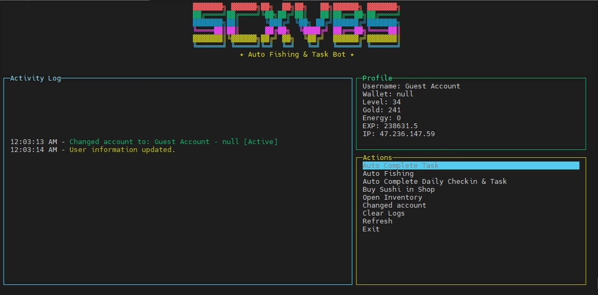

# Fishing Frenzy Blessed Bot

<div align="center">
  

  <div>
    
    
    <a href="https://fishingfrenzy.co?code=62H8PM">
      
    </a>
  </div>
</div>

## 📂 Project Structure

```
fishing-frenzy-blessed-bot/
│
├── index.js         # Main bot script
├── package.json     # Project dependencies
├── Proxy.txt        # Proxy list (optional)
├── README.md        # Project documentation
├── scxvbs.jpg       # Project preview image
└── token.txt        # Game account tokens
```

## 🌟 Project Overview

Fishing Frenzy Blessed Bot is an advanced, interactive terminal-based automation tool for the Fishing Frenzy game. Designed to streamline gameplay across multiple accounts with a rich, user-friendly interface.

### 🎮 Join Fishing Frenzy
👉 [Use My Referral Link for Extra Bonus!](https://fishingfrenzy.co?code=62H8PM)

## ✨ Key Features

### 🤖 Multi-Account Management
- Support for multiple game accounts
- Seamless account switching
- Proxy support for each account
- Independent session management

### 🎣 Automated Fishing Capabilities
- Dynamic fishing range selection
- Automatic energy management
- Configurable fishing attempts
- Detailed fishing result tracking

### 🏆 Automated Tasks
- Automatic social quest completion
- Daily check-in
- Quest completion
- Reward claiming

### 💰 Inventory Management
- Automatic chest opening
- Sushi buying and usage
- Energy restoration
- Detailed inventory tracking

### 🖥️ Interactive Terminal UI
- Blessed.js powered interface
- Real-time logging
- Animated headers and status updates
- Intuitive menu navigation

### 🛡️ Advanced Functionality
- Proxy support
- IP address tracking
- Robust error handling
- Cancellable processes

## 🚀 Prerequisites
- Node.js (v14+ recommended)
- npm (Node Package Manager)
- Valid Fishing Frenzy game tokens
- Optional: Proxy list

## 🔧 Installation

### 1. Clone the Repository
```bash
git clone https://github.com/daimun29/FishingFrenzy-Auto-Bot.git
cd FishingFrenzy-Auto-Bot
```

### 2. Install Dependencies
```bash
npm init -y
npm install blessed ws node-fetch https-proxy-agent
```

### 3. Prepare Configuration Files
- `token.txt`: One token per line
- `Proxy.txt` (optional): One proxy per line

### 4. Run the Bot
```bash
node index.js
```

## 📋 Usage Guide
1. Add tokens to `token.txt`
2. Optionally add proxies to `Proxy.txt`
3. Launch the bot
4. Navigate through menu using keyboard
5. Select actions like fishing, task completion, etc.

## 🛠️ Detailed Features
- Automatic social quest completion
- Daily reward claiming
- Multi-range fishing (short/mid/long)
- Sushi management (buy/use)
- Chest opening
- Proxy rotation
- Detailed logging

## ⚠️ Disclaimer
- Use at your own risk
- Comply with game's terms of service
- Potential account suspension risk

## 🤝 Contributing
1. Fork the repository
2. Create feature branch
3. Commit changes
4. Push to branch
5. Create Pull Request

## 📞 Support & Community
- Telegram: [@scxvbs](https://t.me/scxvbs)
- WhatsApp: [Join Channel](https://whatsapp.com/channel/0029VbAR1YL5EjxqhRhOzT3x)
- GitHub Issues: Report bugs or request features

## 📜 License
MIT License

---

**Happy Fishing! 🎣🤖**
